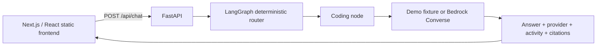

# NexusAI MVP architecture

NexusAI is a workspace that routes a request to a specialist and explains the actions taken. The hackathon target is four visibly different capabilities, with a working Coding route as the first integration milestone.

## First milestone

Two runtime services initially: the web frontend and Python API. Agents are graph nodes inside the API, not separately deployed microservices. Container packaging demonstrates reproducible service boundaries without multiplying deployments.

- `apps/web`: Next.js static export, composer, agent selector, answer and activity display.
- `services/api`: request validation, routing graph, provider adapter and specialist nodes.
- `infra`: AWS SAM template for API Gateway HTTP API and Lambda; Amplify hosts exported frontend assets.
- `docs`: team assignments, integration contract and deployment steps.

The current contract is `POST /api/chat` with `message` and `agent` (`auto`, `coding`, `document`, `search`, `research`). Successful responses include `answer`, `provider`, `activity`, and `citations`; use the API's generated OpenAPI schema for exact fields. Auto routing is deterministic and has a Coding fallback. Document, Search and Research selections currently return HTTP 501 until implemented. They must never silently masquerade as working specialists.

Demo mode is a labeled, fixed fixture for proving transport and UI behavior; it does not generate arbitrary code. Bedrock mode invokes a configured model through Converse. Health identifies configured mode, not credential validity or model availability. A successful real invocation is the readiness gate. Activity initially arrives with the completed response; live streaming is a later enhancement. Activity describes routing and tool actions, not private model reasoning.

## Next milestones, after first-route verification

| Agent | Actual work | Completion evidence |
| --- | --- | --- |
| Coding | Generate/explain/debug code with Bedrock | Different prompts produce relevant answers; generated code is displayed, never executed |
| Document / RAG | Extract PDF pages, chunk text, embed, retrieve, answer from evidence | Answer includes original filename, one-based page and supporting excerpt; unsupported question gets an explicit insufficient-evidence answer |
| Search | Call Tavily with bounded results, synthesize with source URLs | Real result titles and URLs support the answer; provider failure is visible |
| Research | Produce a short plan, run bounded Search calls, synthesize cited findings | Activity shows actual executed steps and citations resolve to retrieved sources |

For RAG, start with text PDFs capped at 5 MB and 30 pages; reject encrypted, malformed and image-only files with useful messages. Use `pypdf` to preserve page numbers. Keep page boundaries while chunking. Store originals in private S3, embeddings in Qdrant Cloud, and source metadata with each vector. The backend applies a session/document filter to every retrieve/delete operation. A client-provided document identifier alone is not authorization. Use a server-issued session and prove that session B cannot retrieve session A's document. Qdrant supports payload-based partitioning; this isolation still depends on correct application filtering. [Qdrant documentation](https://qdrant.tech/documentation/tutorials/multiple-partitions/)

Upload through a short-lived S3 signed upload flow, then ask the API to ingest the stored object. Apply upload size constraints and verify object size, content and ownership again before parsing. Use unique server-generated object keys. S3 signed URLs allow upload without exposing AWS credentials to the browser. [S3 documentation](https://docs.aws.amazon.com/AmazonS3/latest/userguide/PresignedUrlUploadObject.html)

Select and test a Bedrock embedding model separately from the chat model; configure vector dimensions to its actual output. Do not pretend the chat model produces embeddings. Avoid Lambda local disk as persistent storage.

Keep Research to at most two searches and one synthesis for the first version. API Gateway HTTP API has a 30-second maximum integration timeout. If measured execution cannot fit, add an asynchronous job endpoint and polling with durable status, or defer the expanded workflow. A longer Lambda timeout alone does not fix the HTTP API limit. [AWS quota documentation](https://docs.aws.amazon.com/apigateway/latest/developerguide/http-api-quotas.html)

## Scope boundaries

No fine-tuning, Kubernetes, Redis, arbitrary code execution, browser automation, elaborate account system, or agent-per-container architecture. No promise of autonomous deep research. Keep specialist instructions and tool boundaries explicit; retrieved text and web pages are evidence, not instructions. Never fabricate citations or mark a tool successful before it has run.

LangGraph supplies the stateful graph and routing primitives; the application owns the state schema and bounded execution policy. [LangGraph reference](https://reference.langchain.com/python/langgraph/overview)
